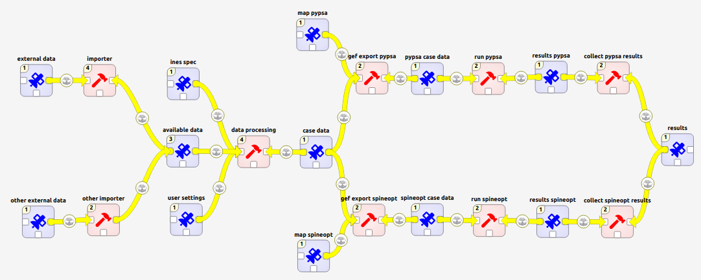

.. Ines spec documentation master file, created by
   sphinx-quickstart on Mon Jun 18 12:58:32 2018.

Welcome to the Ines spec
========================

`Ines spec <https://github.com/ines-tools/ines-spec>`_ is an application,
which provides means to define, manage, and execute complex data processing and
computation workflows, such as energy system models.

If you are new to Spine Toolbox, :ref:`whats_new` section is a good place to start.

.. toctree::
   :maxdepth: 1
   :caption: Contents:

   whats_new
